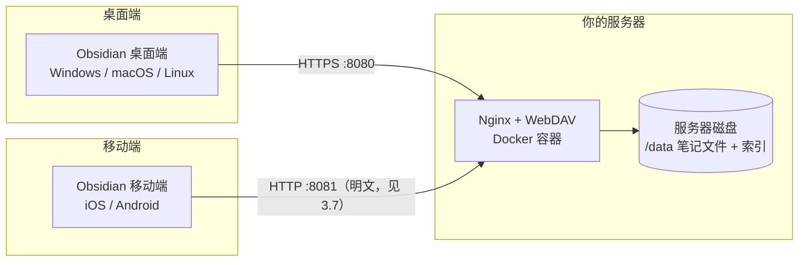

# Obsidian 私有 WebDAV 双向同步方案 · 使用说明

> 一套完全跑在你自己服务器上的 Obsidian 同步方案，桌面端（Windows / macOS / Linux）与移动端（iOS / Android）通用。
> 不使用任何第三方同步服务，数据 100% 存储在你自己的服务器。

---

## 一、方案概述

### 1.1 实现原理

本方案由两部分组成：

- **服务端**：在你的服务器上用 Docker 跑一个轻量的 Nginx + WebDAV 服务，对外提供标准 WebDAV 接口（支持 PUT / DELETE / MKCOL / COPY / MOVE / PROPFIND / OPTIONS），所有笔记文件保存在服务器本地磁盘。
- **客户端**：一个 Obsidian 插件，通过标准 WebDAV 协议与服务器通信，实现双向同步。

插件每次同步时：

1. 扫描本地 vault 文件，对**内容变更过的文件**计算 SHA-256 哈希（增量，不重复计算未改动文件）；
2. 通过 `PROPFIND` 拉取服务器文件清单与时间戳；
3. 借助服务器上保存的一份「元数据索引」比对两端内容哈希，判断哪些文件需要上传 / 下载 / 冲突；
4. 按你配置的冲突策略处理同名文件的两边修改；
5. 把本次同步结果写回服务器索引，并持久化本地状态。

### 1.2 架构图



数据流：两端都只与你的服务器通信，服务器是唯一的数据中心，天然实现「一端修改、另一端拉取」的双向同步。

### 1.3 方案优势

| 优势 | 说明 |
| --- | --- |
| **私有可控** | 数据只存在你自己的服务器，不经过任何第三方云 |
| **跨端兼容** | 同一套插件同时支持桌面端与移动端 Obsidian |
| **速度快** | 增量同步 + 内容哈希校验，只传变化的文件 |
| **成本低** | 1 核 256M 的小机即可运行，零额外订阅费用 |
| **标准协议** | 基于 WebDAV，未来也可被其他支持 WebDAV 的软件读写 |

### 1.4 适用场景与不适用场景

**适用：**
- 希望笔记数据完全私有、不上传第三方云盘；
- 需要在电脑和手机之间同步 Obsidian；
- 服务器配置较低（最低 1 核 256M）。

**不适用 / 需谨慎：**
- 需要多人实时协作编辑同一篇笔记（本方案是「最终一致」的双向同步，不是实时协同，两人同时改同一文件会按冲突策略处理）；
- 完全不懂命令行、也无法联系他人协助部署服务器（部署需要基本的服务器操作）；
- 没有自有服务器也不愿租用云服务器。

---

## 二、环境准备

### 2.1 服务器最低配置

| 项目 | 最低要求 | 推荐 |
| --- | --- | --- |
| CPU | 1 核 | 1 核及以上 |
| 内存 | 256 MB | 512 MB 及以上 |
| 磁盘 | 1 GB 可用（视笔记量而定） | 按笔记量预留 |
| 系统 | 支持 Docker 的 Linux | **OpenCloudOS 9**（本方案已验证） |
| 带宽 | 1 Mbps | 5 Mbps 及以上（大文件更快） |
| 网络 | 服务器需有公网 IP 或内网穿透 | 固定公网 IP + 域名最佳 |

### 2.2 操作系统

- 已在 **OpenCloudOS 9** 实测可用；
- 其他 RHEL 系（CentOS 7+/9、Rocky、Alma）、Debian / Ubuntu 同样可用，脚本会自动适配 Docker 安装；
- 需要 `root` 权限执行部署脚本。

### 2.3 本地 Obsidian 版本

- 桌面端 Obsidian ≥ **1.0**（本插件 `minAppVersion` 设为 `0.15.0`，覆盖绝大多数在用版本）；
- 移动端 Obsidian（iOS / Android）≥ **1.4**；
- 无需 Obsidian 付费订阅（同步功能与官方会员无关）。

---

## 三、服务端部署教程

### 3.1 连接到你的服务器

在你的电脑上打开终端（Windows 用 PowerShell 或 Terminal，macOS/Linux 用终端），通过 SSH 连接：

```bash
ssh root@你的服务器IP
```

例如：`ssh root@203.0.113.10`。首次连接按提示输入密码 / 确认指纹。

> 如果服务器是云厂商的，请确认已开放 22 端口（SSH）。

### 3.2 下载本方案文件到服务器

方式 A（推荐，若服务器能访问 GitHub）：

```bash
# 安装 git（如未安装）
yum install -y git        # OpenCloudOS / CentOS / RHEL
# 克隆或解压本方案，进入 server 目录
cd ~ && git clone <本仓库地址> obsidian-webdav-sync
cd obsidian-webdav-sync/server
```

方式 B（更简单）：把本方案压缩包 `server/` 目录里的 5 个文件上传到服务器任意目录，例如 `/root/obsidian-webdav-sync/server/`：

```
server/
├── Dockerfile
├── docker-compose.yml
├── entrypoint.sh
├── nginx.conf
└── deploy.sh
```

可用 `scp` / 宝塔 / 任意 SFTP 工具上传。

> HTTPS 所需的 TLS 证书目录 `ssl/` **无需手动创建**：容器首次启动时会自动生成。若你已用受信任证书（Let's Encrypt），把它放进 `server/ssl/` 即可，容器不会覆盖。

### 3.3 执行一键部署脚本

进入 `server/` 目录后执行：

```bash
sudo bash deploy.sh
```

脚本会自动完成以下事情（无需你手动一步步做）：

1. 检测并安装 **Docker** 和 **Docker Compose**；
2. 创建数据目录 `./data`；
3. 交互式询问 **WebDAV 用户名和密码**（也可非交互传入环境变量）；
4. 把账号密码写入 `.env`，容器启动时自动生成认证文件；
5. 若服务器开着 `firewalld`，自动放行 **8080（HTTPS）与 8081（手机明文）** 端口；
6. 构建并启动服务（`restart: always`，服务器重启后自动拉起），并**默认启用 HTTPS**（首次启动自动生成自签名证书）；
7. 本地验证服务，并**打印访问地址（`https://...`）、用户名**。

交互示例：

```
[INFO] 开始部署 Obsidian 私有 WebDAV 同步服务 ...
[INFO] 检测到已安装 Docker：Docker version 26.1.3
[INFO] Docker Compose 可用：Docker Compose version v2.27.0
[INFO] 数据目录已就绪：./data
请输入 WebDAV 用户名 [默认 obsidian]: obsidian
请输入 WebDAV 密码（不会回显）: ********
请再次输入密码确认: ********
[INFO] 账号密码已写入 .env（权限 600）。
...
[INFO] WebDAV 服务（HTTPS）验证通过 ✅
[INFO] WebDAV 服务（HTTP 明文 · 安卓端）验证通过 ✅

==================================================
 部署完成！请在 Obsidian 插件中填写以下地址：
   电脑端: https://203.0.113.10:8080/
   安卓端: http://203.0.113.10:8081/
   用户名: obsidian
   密码: ******（你设置的密码）
==================================================
```

> **非交互模式**（适合写脚本 / 自动化）：
> ```bash
> WEBDAV_USER=obsidian WEBDAV_PASS='你的强密码' sudo -E bash deploy.sh
> ```

### 3.4 防火墙与安全组端口开放

本方案对外提供**两个端口**，请一并放行：

| 端口 | 协议 | 用途 | 谁在用 |
| --- | --- | --- | --- |
| `8080` | **HTTPS**（自签名证书） | 加密传输，桌面端首选 | Windows / macOS / Linux 桌面版 |
| `8081` | **HTTP 明文** | 供无法信任自签名证书的客户端使用 | 安卓手机（Android 7+ 限制，见 3.7） |

- **云厂商安全组**（如阿里云/腾讯云/华为云）：在控制台「安全组」里**入方向**放行 `8080` 与 `8081`，授权对象 `0.0.0.0/0`（或仅限你的 IP）。
- **服务器防火墙（firewalld）**：脚本已尝试自动放行；也可手动执行：
  ```bash
  firewall-cmd --permanent --add-port=8080/tcp
  firewall-cmd --permanent --add-port=8081/tcp
  firewall-cmd --reload
  ```
- 若使用 `iptables` 而非 firewalld，请相应添加放行规则。

> 只打算用电脑同步？那把 `8081` 从安全组和 `docker-compose.yml` 里去掉即可，服务端就只剩加密端口。

### 3.5 HTTPS 已默认启用（自签名证书）+ 一个手机专用明文端口

本方案**默认就启用 HTTPS**：容器首次启动时，若 `./ssl` 目录里没有证书，`entrypoint.sh` 会自动生成一张**自签名证书**，Nginx 以 TLS 加密监听 **8080** 端口。

- 好处：账号密码不再以明文（Base64）在网络上传输，直接从「裸 HTTP」升级为加密传输；
- 代价：自签名证书不被系统信任，**客户端首次连接会提示证书不受信任**，需要手动信任一次（见 3.6 节）。

**为什么还留了一个明文端口？**

安卓（Android 7+）有一条硬性系统策略：**App 默认只信任系统内置的 CA，用户在手机上手动安装的证书不会被 App 采用**。也就是说，自签名证书在安卓的 Obsidian 里几乎必然报 `CERT_AUTHORITY_INVALID`。为了不让手机端彻底用不了，Nginx 额外在 **8081** 端口以明文提供**同一份数据、同一套账号**，专供手机端使用（详见 3.7 节）。

| 客户端 | 服务器地址填法 | 传输安全 |
| --- | --- | --- |
| 电脑（Windows/macOS/Linux） | `https://服务器IP:8080/` | 加密（需信任一次自签名证书） |
| 安卓手机 | `http://服务器IP:8081/` | **明文**（密码仅 Base64） |
| 想两边都安全 | 换受信任证书（Let's Encrypt），两边都填 `https://域名:8080/` | 加密且免装证书（推荐，见 3.6 方式二） |

因此：

- 电脑上，插件「服务器地址」要填 **`https://服务器IP:8080/`**（注意是 `https`，不是 `http`）；
- 手机上，插件「服务器地址」填 **`http://服务器IP:8081/`**（注意是 `http` 且端口是 `8081`）；
- 若你更想「零信任弹窗 + 全加密」，请按 3.6 节换成受信任证书（Let's Encrypt）。

### 3.6 信任证书 / 升级为受信任证书

**方式一：信任自签名证书（无需域名）**

> 容器生成的自签名证书已按现代客户端要求写入 `SAN`（含服务器 IP）与 `CA:TRUE` 标记 —— 这是「导入后能被 Obsidian / Chromium 真正接受」的前提。若你用的是更早版本的证书，请按下面第 1 步重新生成。

**电脑端（Windows，桌面版 Obsidian 走系统信任库）**

1. 在 `.env` 里加上服务器公网 IP，让证书 SAN 覆盖它，然后删掉旧证书重建使其生效：
   ```
   TLS_SAN_IP=你的服务器公网IP
   ```
   ```bash
   rm -f ssl/fullchain.pem ssl/privkey.pem
   docker compose up -d --force-recreate
   docker compose logs --tail 15 webdav     # 日志里应显示 SAN 包含你的 IP
   ```
2. 把证书取到本地：`cat ssl/fullchain.pem`，内容另存为 `sync.crt`（**要包含 BEGIN/END 那两行**）。
3. Windows 双击 `sync.crt` → 安装证书 → 存储位置选「**本地计算机**」→ 放入「**受信任的根证书颁发机构**」→ 完成。
4. **彻底退出并重启 Obsidian**，再点「测试连接」。

**iOS**

把 `fullchain.pem` 传到手机安装，再到「设置 → 通用 → 关于本机 → 证书信任设置」开启信任，通常可用。

**Android**

⚠️ 系统限制：Android 7+ 的 App **默认不信任用户手动安装的 CA**，即使你在手机上成功导入了证书，Obsidian 移动端仍会以 `CERT_AUTHORITY_INVALID` / `Trust anchor for certification path not found` 拒绝连接。

所以安卓端有两条现实路线：

1. **走明文端口（本方案已内置，最省事）**：手机端「服务器地址」改填 `http://服务器IP:8081/`，不碰证书。详见 **3.7 节**；
2. **换成受信任证书（推荐，一劳永逸）**：按下面「方式二」申请 Let's Encrypt 证书，手机端自然就信任了，无需安装任何东西，地址仍填 `https://域名:8080/`。

**方式二：升级为受信任证书（推荐，需域名）**

1. 准备一个域名（如 `sync.example.com`），把 A 记录指向服务器 IP；
2. 用 Let's Encrypt 申请免费证书：
   ```bash
   # 以 standalone 方式签发（需临时占用 80 端口，请确认域名已解析到本机）
   yum install -y certbot
   certbot certonly --standalone -d sync.example.com
   # 证书默认位于 /etc/letsencrypt/live/sync.example.com/
   ```
3. 把证书复制到 `server/ssl/`，覆盖自签名证书：
   ```bash
   cp /etc/letsencrypt/live/sync.example.com/fullchain.pem server/ssl/fullchain.pem
   cp /etc/letsencrypt/live/sync.example.com/privkey.pem   server/ssl/privkey.pem
   ```
4. 重启容器即可生效：
   ```bash
   docker compose restart
   ```
5. 之后插件「服务器地址」填 `https://sync.example.com:8080/`。

> 说明：证书放在宿主机 `server/ssl/` 并通过 `./ssl:/etc/nginx/ssl` 挂载进容器（读写挂载，便于容器首次自动生成自签名证书）。容器**只在该目录没有证书时生成自签名证书，不会覆盖**你放入的受信任证书。

### 3.7 安卓端连接（明文端口方案）

**为什么手机不能直接用 8080 的 HTTPS 地址**

自签名证书在安卓上基本没用：Android 7+ 的系统策略是「App 默认只信任系统内置 CA」，你手动导入的证书落在「用户证书」区，Obsidian 这类 App 默认不读取。所以手机端要么走明文端口（本节），要么把服务端换成受信任证书（3.6 方式二）。

**手机端配置步骤**

1. 确认服务端已放行 **8081**（见 3.4），容器在这个端口以明文提供**同一份数据、同一套账号**；
2. 把插件装到手机并启用（见 4.2）；
3. 进入「设置 → 第三方插件 → WebDAV Sync」，「服务器地址」填 **`http://服务器IP:8081/`**
   —— **协议必须是 `http`，端口是 `8081`，结尾的 `/` 不能少**；
4. 用户名、密码与电脑端完全一致；
5. 点「测试连接」→ 首次会弹窗输入密码 → 通过后点同步即可。

**先做个 2 分钟体检（强烈建议）**

在手机的**浏览器**里打开 `http://服务器IP:8081/`：

| 浏览器里的表现 | 说明 |
| --- | --- |
| 弹出账号密码框，输入后能看到文件列表 | 端口与账号都通了，接着在 Obsidian 里试即可 |
| 转圈后提示无法访问 / 超时 | 8081 没放行：检查云安全组、服务器防火墙，并确认容器映射里有 `8081:8081` |
| 一直重复弹密码框 | 账号密码不对（服务器上 `.htpasswd` 是旧的）：`docker compose up -d --force-recreate` 重建 |

**如果 Obsidian 报「明文被拦」（cleartext not permitted）**

Android 9+ 还有第二条策略：**默认禁止 App 发起明文 HTTP 请求**。有的 App 放开了，有的没放开。若插件报错里出现 `cleartext` 字样，说明这台手机上这条路走不通，只能改走正式证书：按 3.6 方式二用 Let's Encrypt 签证书，两端地址都换回 `https://域名:8080/`。插件已内置该错误的翻译，会直接提示你两个选择。

**安全提醒**

8081 是**明文**端口：Basic 认证的账号密码只做 Base64 编码，任何能看到你网络流量的人都能读到。
请务必使用强密码，并优先在手机流量/家庭 WiFi 等相对可信的网络下同步；条件允许时建议直接上 3.6 方式二的正式证书，把 8081 关掉。

### 3.8 验证 WebDAV 服务是否正常

在服务器或任意能访问到服务器的机器上执行（把 IP、用户名、密码换掉）：

```bash
curl -k -u 用户名:密码 -X PROPFIND "https://服务器IP:8080/" \
  -H "Depth: 0" -H "Content-Type: application/xml; charset=utf-8" \
  --data '<propfind xmlns="DAV:"><prop><getlastmodified/></prop></propfind>'
```

（`-k` 表示跳过自签名证书校验，仅用于本机连通性测试。）

若返回一段 XML（含 `<response>`、`<getlastmodified>` 等标签）即表示服务正常。

手机端的明文端口同样可以这样验证（把 `-k` 与 `https` 换成 `http`，端口换成 `8081`）：

```bash
curl -sS -u 用户名:密码 -X PROPFIND "http://服务器IP:8081/" \
  -H "Depth: 0" -H "Content-Type: application/xml; charset=utf-8" \
  --data '<propfind xmlns="DAV:"><prop><getlastmodified/></prop></propfind>'
```

也可以直接在浏览器打开 `https://服务器IP:8080/`（首次会提示证书不受信任，选择「继续前往」）或 `http://服务器IP:8081/`，弹出账号密码框、输入后能看到目录列表即正常。

---

## 四、插件安装教程

插件目录 `plugin/` 已经编译好可直接使用的三个文件：

```
plugin/
├── manifest.json   # 插件清单
├── main.js         # 已编译的插件主体
└── styles.css      # 样式
```

> 如果你要自行修改源码后再用，请见文末「附：从源码构建插件」。

### 4.1 桌面端 Obsidian 安装插件

**方法一：手动放置（最简单）**

1. 打开你的笔记库（vault）所在文件夹；
2. 进入 `.obsidian/plugins/` 目录（`.obsidian` 默认隐藏，需在文件管理器开启「显示隐藏文件」）；
3. 新建文件夹 `obsidian-webdav-sync`，把 `manifest.json`、`main.js`、`styles.css` 三个文件复制进去；
4. 打开 Obsidian → 设置 → 第三方插件 → 关闭「安全模式」→ 在插件列表里找到 **WebDAV Sync** 并启用。

**方法二：用 Beta Reviewer 安装（如已开启）**

社区里可通过 BRAT 添加本地/远程插件，但手动放置对新手最稳妥，推荐方法一。

### 4.2 移动端 Obsidian 安装插件

移动端 Obsidian **不支持**直接浏览手机文件系统放文件，有三种办法：

**办法 A：用现成的安卓安装包（安卓用户推荐）**

方案目录下已准备好 **`obsidian-webdav-sync-android.zip`**（内含 `obsidian-webdav-sync/` 文件夹，已按手机解压要求打包）：

1. 把 `obsidian-webdav-sync-android.zip` 传到手机（微信「文件传输助手」、QQ、数据线都可以）；
2. 用「MT 管理器 / 解压专家 / 系统文件管理」解压到你的库的插件目录：
   `Android/data/com.obsidian.md/files/<你的库名>/.obsidian/plugins/`
   解压后的结构应为：`.obsidian/plugins/obsidian-webdav-sync/{main.js, manifest.json, styles.css}`；
3. 打开 Obsidian → 设置 → 第三方插件 → 关闭「安全模式」→ 在列表里启用 **WebDAV Sync**。

> ⚠️ Android 11 以上对 `Android/data` 有访问限制，系统自带的文件管理器可能打不开该目录：
> - 首选 **MT 管理器**（首次进入会申请「Android/data 访问授权」，同意即可）；
> - 如果你的库不在 `Android/data` 下（新版 Obsidian 常把库放在「文档」目录），就把 zip 解压到 **库目录/.obsidian/plugins/** 即可，更省事。

**办法 B：从电脑端借道同步**

若手机上装了解压类插件，也可以：电脑端把 `obsidian-webdav-sync` 文件夹（或 zip）作为普通附件放进库，同步到手机后在手机上解压到 `.obsidian/plugins/`。

**办法 C：iOS**

借助「文件」App + Obsidian 的「打开文件夹」机制，或用 iMazing / 隔空投送把插件文件夹放进 Obsidian 库的 `.obsidian/plugins/`。

> 移动端同样需要先在「设置 → 第三方插件」中关闭安全模式才能启用。

### 4.3 启用插件

启用后，左侧功能区会多出一个**刷新图标**（点击即立即同步），底部状态栏会出现同步状态图标（云朵 ☁），命令面板里会出现「WebDAV Sync: 立即同步」等命令，即表示安装成功。

---

## 五、插件配置详解

打开 Obsidian → 设置 → 第三方插件 → 找到 **WebDAV Sync** → 点击打开设置页。

### 5.1 基础连接配置

| 设置项 | 填写说明 | 示例 |
| --- | --- | --- |
| 服务器地址 | WebDAV 根地址，**必须以 `/` 结尾**。电脑端填 `https://...:8080/`；**安卓手机填 `http://...:8081/`**（原因见 3.7） | `https://203.0.113.10:8080/`（电脑）<br>`http://203.0.113.10:8081/`（安卓） |
| 用户名 | 部署时设置的 WebDAV 用户名 | `obsidian` |
| 密码 | 部署时设置的 WebDAV 密码 | `你的密码` |
| 记住密码 | 默认**关闭**：密码不写入磁盘、仅保存在内存，重启 Obsidian 后首次同步会弹窗要求重输；开启后密码以明文存于本地 `data.json` | 建议保持关闭；已用受信任 HTTPS 又想免重输时再开 |

> ⚠️ 服务器地址**一定要以 `/` 结尾**，否则路径拼接会出错导致同步失败。

> 🔐 关于「密码不落盘」：默认情况下，插件**不会**把密码写进任何文件，只存活在本次运行的进程内存里；你需要在首次同步时输入一次，之后本轮运行内不再询问。如果希望重启后也免输，可打开「记住密码」，但密码会以明文保存在本地 vault（Obsidian 的插件数据机制无法加密存储），因此**仅建议在服务端已启用受信任 HTTPS 时开启**。

### 5.2 连接测试

填好服务器地址、用户名后即可（密码可留空）。若未勾选「记住密码」且尚未输入过密码，点击「测试连接」或触发同步时会**自动弹窗**让你输入，输入后本次运行内不再重复询问。点击 **「测试连接」** 按钮：

- 显示「✅ 连接成功，WebDAV 服务可用」→ 配置正确，可继续；
- 显示「❌ 连接失败：...」→ 按提示检查地址结尾 `/`、账号密码、服务器端口是否开放。

### 5.3 同步策略设置

| 设置项 | 说明 | 建议 |
| --- | --- | --- |
| 定时同步间隔（分钟） | 每隔 N 分钟自动同步一次；填 `0` 关闭 | 一般填 `10`~`30` |
| 实时同步 | 开启后，本地文件一有增删改就自动同步（带 300ms 防抖） | 建议开启 |
| 仅 WiFi 同步（移动端） | 移动端仅 WiFi/有线网络下才同步，省流量 | 手机建议开启 |
| 状态栏显示 | 是否在底部状态栏显示同步状态图标 | 建议开启 |
| 左侧边栏同步按钮 | 在左侧功能区（ribbon）显示一个刷新图标，点击即可立即同步 | 建议开启 |

> 修改「定时同步间隔」后会立即生效，无需重启 Obsidian。

### 5.4 忽略规则配置

每行一条规则，支持 `*`、`?`、`**` 通配（glob）：

```
.obsidian/workspace.json
.obsidian/workspace
.trash
.DS_Store
*.tmp
```

- 以上为**默认已内置**的规则，无需你再写；
- 如需忽略更多，例如忽略某个文件夹：`我的私密笔记/**`；
- 忽略某个后缀：`*.excalidraw`；
- 修改后保存即可生效，无需重启。

### 5.5 冲突处理策略

当**同一篇笔记在两端都被修改**时，按以下策略处理：

| 策略 | 行为 | 适用场景 |
| --- | --- | --- |
| **最新优先**（默认） | 比较两端修改时间，较新的一方覆盖较旧的一方 | 大多数情况，谁最后改以谁为准 |
| **本地优先** | 始终用本地文件覆盖服务器 | 以某台设备为「主」，其它设备跟着它 |
| **远端优先** | 始终用服务器文件覆盖本地 | 以服务器为「主」 |
| **双版本保留** | 本地版本保持不变，远端版本另存为「`文件名 (remote 时间戳)`」副本 | 不想丢失任何一方的修改，之后手动合并 |

**选择建议**：普通个人使用选「最新优先」即可；如果你经常在多设备同时编辑且不想丢内容，选「双版本保留」最安全。

---

## 六、同步使用指南

### 6.1 首次全量同步注意事项

1. **先在一端完成首次同步**：建议在「笔记较多」的那台设备（通常是电脑）先执行一次同步，把现有笔记上传到服务器；
2. 在另一端（手机/另一台电脑）安装并配置好插件后，执行一次同步，即可把服务器上的笔记**下载**下来；
3. 首次同步可能耗时较长（取决于笔记数量与体积），请保持网络稳定，不要中途关闭 Obsidian；
4. 首次同步前建议先「测试连接」通过，避免大量文件传输到一半才报错。

> 小技巧：首次全量同步建议在 WiFi 下进行；若笔记量巨大，可分文件夹逐步同步（先把大部分不动的笔记上传）。

### 6.2 日常同步操作

- **自动同步**：开启「实时同步」后，你新建/编辑/删除/重命名笔记会自动触发同步（300ms 防抖，连续打字不会频繁触发）。
- **定时同步**：即使关闭实时同步，也会按「定时同步间隔」周期性同步。
- 同步是**双向**的：在任何一端修改，另一端下次同步时都会拉取最新内容。

### 6.3 状态栏图标含义

底部状态栏显示同步状态（点击图标可手动触发一次同步）：

| 图标 | 状态 | 含义 |
| --- | --- | --- |
| ☁（云） | 空闲 | 未同步 / 等待下次同步 |
| 🔄（sync） | 同步中 | 正在上传/下载 |
| ✅（check） | 成功 | 刚完成一次同步 |
| ⚠️（alert） | 出错 | 同步异常，点开查看通知或看控制台 |
| 📵（wifi-off） | 受限 | 开启了「仅 WiFi」但当前非 WiFi，已跳过 |

### 6.4 手动同步的方法

- **点击左侧边栏图标**：左侧功能区（ribbon）有一个刷新图标，点击即同步；同步中会旋转、成功后短暂显示对勾（可在设置中关闭）；
- **点击状态栏图标**：直接触发一次同步；
- **命令面板**：`Ctrl/Cmd + P` 打开命令面板，输入「立即同步」，执行 **WebDAV Sync: 立即同步**；
- **切换实时同步**：命令面板执行「WebDAV Sync: 切换实时同步开关」；
- **查看状态**：命令面板执行「WebDAV Sync: 显示同步状态」，弹出上次同步时间。

### 6.5 删除文件会怎样（v1.3.0 起，v1.4.2 完善）

同步是**双向**的，删除也会被同步。正确理解它的行为：

- **在某一台设备上删除文件**，会：
  1. 从**云服务器**删除；
  2. 在同步索引里留下一条「删除墓碑」；
  3. 其它设备下次同步时**自动删掉各自的副本**（进 Obsidian 回收站，可恢复）。
- **不会"复活"**：早期版本因为缺少删除记录，别的设备会把"本地有、服务器没有"当成新文件重新上传，导致删不掉；v1.3.0 加入删除墓碑后已修正。
- **删除后又重新编辑/新建同名文件**：视为「你要保留新内容」，删除被撤销，新内容同步到所有设备。
- **安全护栏（宁可漏删，不可误删）**：
  - 若某设备本地列表异常为空、或单次待删文件过多，会**跳过删除**并提示，避免误删；
  - 若远端文件在删除前已被别的设备改过，会**保留远端版本**（改为下载回来），不会误删别人的修改；
  - 删除一律走 **Obsidian 回收站**（建议在 `设置 → 文件与链接 → 删除的文件` 选「Obsidian 回收站」），删错可恢复。
- **删除墓碑有效期**：默认 30 天，过期自动清理，避免索引无限增长。
- **删除保护阈值（v1.4.1 起放宽）**：只有当「本地文件列表异常为空」或「单次要删的比例超过 95%」时才会拦；正常地整批删掉一个资料夹不会再被拦。

### 6.6 服务器上的两个隐藏文件（不用管，但要知道）

服务器根目录下有两样以 `_obsidian_webdav_sync` 开头的东西，插件会**整体忽略**它们，
不会下载到电脑/手机，也不会因为它们在服务器上就"多出内容"：

| 名称 | 作用 |
| --- | --- |
| `_obsidian_webdav_sync_index.json` | 同步索引：记录每个文件的 mtime / 大小 / SHA-256，以及「删除墓碑」。**不要手动删它**，删了会退化成全量重扫并把删过的文件当成新文件 |
| `_obsidian_webdav_sync_trash/<日期>/…` | 服务器端「回收区」：大批量清理时先把文件**移动**到这里（服务端操作、不耗流量），确认无误再删原目录。想恢复时把里面的文件移回原路径即可 |

> v1.4.2 起，插件在遍历远端目录时会主动跳过这两个名字，所以回收区即使很大也不会拖慢同步。

---

## 七、常见问题与排错

### 7.1 连接失败常见原因

| 现象 | 可能原因 | 解决办法 |
| --- | --- | --- |
| 连接超时 / 无响应 | 服务器 IP/端口不通 | 检查安全组与防火墙是否放行（电脑端 8080、手机端 8081）；`telnet IP 8080` 测试 |
| 401 Unauthorized | 账号或密码错误 | 重新填写；或在服务器执行 `docker compose down && docker compose up -d` 并用 deploy.sh 重设密码 |
| 403 Forbidden | 路径权限 / 地址没以 `/` 结尾 | 服务器地址务必以 `/` 结尾 |
| 405 / 404 方法不允许 | nginx 未启用 WebDAV 扩展模块 | 确认使用的是本方案 `Dockerfile`（含 `nginx-mod-http-dav-ext`），重新 `docker compose up -d --build` |
| 构建时 apk 报 `TLS: unspecified error` / `unable to select packages ... no such package` | 容器内默认 Alpine 源 `dl-cdn.alpinelinux.org` 在国内网络下 TLS 握手失败，拉不到索引 | 本方案 `Dockerfile` 已内置**自动切换国内源**（腾讯云内网 → 阿里云 → 清华），重新 `docker compose up -d --build` 即可；若三者都不通，可在 Dockerfile 的源列表里换成你能访问的镜像站 |
| 构建报 `nginx-x.y.z breaks: nginx-mod-http-dav-ext-...[nginx=...]` | nginx 与 WebDAV 扩展模块**版本不匹配**（官方 `nginx:alpine` 用的是 nginx.org 的 nginx，与 Alpine 仓库的模块对不上） | 本方案 `Dockerfile` 已改为**从 `alpine:3.24` 基础镜像把 nginx 与模块一起安装**，两者版本天然一致；重新构建即可。**请勿**改回 `FROM nginx:alpine` |
| 证书报错（CERT_AUTHORITY_INVALID 等） | 自签名证书未被设备信任；或证书缺少 `SAN` / `CA:TRUE`，导致「导入系统信任后仍被拒」 | 电脑端：按 3.6 节**重新生成**证书（新版已内置 SAN+CA）并导入系统信任；**安卓端**：系统限制导致装证书也没用，请改填 `http://IP:8081/`（见 3.7），或换正式证书 |
| 安卓报 `Trust anchor for certification path not found` / `SSLHandshakeException` | 安卓 App 默认不信任「用户安装的证书」，自签名证书在手机上无法生效 | 改用明文端口 `http://服务器IP:8081/`（见 3.7）；想全加密就走 3.6 方式二的正式证书 |
| 安卓报 `cleartext not permitted`（明文被拦） | Android 9+ 默认禁止 App 发起明文 HTTP 请求 | 这台手机上明文方案走不通，改走正式证书：按 3.6 方式二签 Let's Encrypt 证书，两端都填 `https://域名:8080/` |
| ERR_EMPTY_RESPONSE / SSL 握手失败 | 协议不匹配，服务端已是 HTTPS 却用 `http://` 访问 | 把地址改为 `https://` 开头；服务端应为本方案默认的 TLS 监听 |
| 首次同步弹出「输入 WebDAV 密码」窗口 | 正常现象：未开启「记住密码」时密码不落盘 | 输入一次即可，本轮运行内不再询问；想免重输可开启「记住密码」 |

### 7.2 同步冲突如何处理

- 若策略为「最新优先 / 本地优先 / 远端优先」：插件会自动按规则覆盖，不会丢文件（被覆盖的一方内容不再保留，请谨慎）。
- 若策略为「双版本保留」：会自动生成 `文件名 (remote 时间戳).md` 副本，你再手动合并两份内容、删除多余副本即可。
- 任何冲突都会在同步通知里提示「冲突 N」，可在设置里把策略改成「双版本保留」以避免误覆盖。

### 7.3 文件不同步排查步骤

1. 确认该文件/文件夹**未被忽略规则**匹配（如 `.tmp` 后缀、`.trash` 目录默认忽略）；
2. 在设置页点「测试连接」确认服务可达；
3. 手动点一次状态栏图标触发同步，观察通知；
4. 打开开发者控制台（桌面端 `Ctrl/Cmd + Shift + I` → Console）查看 `[WebDAV Sync]` 开头的错误日志；
5. 确认服务器磁盘没满（`df -h` 看 `/data` 所在分区）。

### 7.4 移动端同步异常

- **iOS**：证书若为自签名，需要在「设置 → 通用 → 关于本机 → 证书信任设置」里手动信任；HTTPS 域名需可被解析。
- **Android**：**不建议**导入自签名证书（系统限制导致装了也无效），请把「服务器地址」填成 `http://服务器IP:8081/`（见 3.7）；另需确认已授予 Obsidian 文件访问权限；如用「仅 WiFi 同步」，请确认当前是 WiFi。
- 手机端地址检查清单：协议是 `http` 还是 `https`、端口是 `8081` 还是 `8080`、结尾是否有 `/` —— 这三处最常填错。
- 移动端对大文件更敏感，单个笔记建议不超过数十 MB；图片/附件多时可分批同步。
- 若插件在移动端不显示：确认已放入正确 vault 的 `.obsidian/plugins/` 且关闭了安全模式。

### 7.5 大文件同步问题

- `nginx.conf` 已设 `client_max_body_size 0`（不限制上传大小），但超大文件（>100MB 单文件）在弱网下易超时；
- 如频繁超时，可把 `client_max_body_size 0` 显式改为 `2g` 并调大各类 `timeout`；
- 建议把超过几十 MB 的附件放进独立目录，必要时用其他网盘分担。

### 7.6 本地笔记大面积消失怎么办（重要）

**现象**：某次同步后，电脑上的笔记大量消失——文件夹还在，但里面是空的。

**原因（真正的根因）**：WebDAV/DAV 响应体是**带命名空间前缀**的，例如 nginx 返回的是 `<D:response>`、`<D:propstat>`。而浏览器解析 XML 文档时，`getElementsByTagName("response")` 是按「限定名(qualified name)」匹配的——`"response"` 匹配不到 `"D:response"`，于是解析结果**恒为空列表**。后果：插件的「远端文件清单」永远是空的 → 只会上传、永远不会下载；一旦本地被删，就再也拉不回来。批量删除又叠加了「目录判定」的次生问题，共同造成了整库被删。

**该缺陷已在 v1.2.0 修复**：解析改为按元素 `localName` 递归匹配（忽略前缀），并列目录、下载、删除全部走通；同时新增「海量删除保护」（见 8.4）与「删除走回收站」。

**恢复办法（数据没丢，服务器是唯一真源）**：

1. 确认服务器上数据仍在（在服务器执行，应能看到你的目录）：
   ```bash
   docker compose exec -T webdav ls /data
   ```
2. 把**最新版** `main.js` 覆盖到 `你的库/.obsidian/plugins/obsidian-webdav-sync/main.js`（见 4.1）；
3. **让 Obsidian 加载新版**（二选一）：
   - 简单：`设置 → 第三方插件`，把 **WebDAV Sync 关闭再开启**（会重新从磁盘读取 main.js，**不必重启整个 Obsidian**）；
   - 彻底：完全退出并重开 Obsidian。
4. 打开插件设置，顶部会显示一行 **`当前插件版本：…`**——**看到这行、且版本号与你替换的 main.js 一致，才说明新版已生效**；若显示的还是旧的版本号，说明 Obsidian 仍在跑旧代码，回到第 3 步；
5. 点「立即同步」——应显示「**远端 N 个 / 本地 M 个**，开始同步…」，随后自动**全量下载**回来；
6. 首次恢复要传完整个库（几百 MB 属正常），中断了也没关系，再次同步会**续传**（已下载的会跳过）。

> 恢复过程中**不要**用旧版插件，也不要在删除操作进行到一半时重载插件：旧版会把「本地有、服务器没有」当成新文件，反而把你删掉的东西又传回服务器。

**两个注意点**：

- 恢复前**不要**手动往本地复制同名文件，否则会被判定为冲突；
- 恢复完成后，建议把 Obsidian 的删除策略改成回收站（见 8.4 第 3 条），以后万一再误删还能捞回来。

---

## 八、安全与备份建议

### 8.1 定期备份笔记

服务器上的数据就是唯一真源，务必备份：

```bash
# 在服务器上，把 /data 打包到别处或下载到本地
docker compose exec -T webdav tar czf - -C /data . > /root/obsidian-backup-$(date +%F).tar.gz

# 或直接在宿主机对挂载目录做备份
tar czf /backup/obsidian-$(date +%F).tar.gz -C /path/to/server/data .

# 配合定时任务（crontab -e）每天凌晨备份
0 3 * * * tar czf /backup/obsidian-$(date +\%F).tar.gz -C /path/to/server/data .
```

也可以开启 Obsidian 自带的「文件恢复」与「历史版本」功能作为第二重保护。

### 8.2 账号密码安全

- **密码务必使用强密码**（12 位以上，含大小写+数字+符号）；
- `.env` 文件权限为 `600`，不要把它提交到公开仓库；
- 不同服务不要用同一密码；
- 插件默认**不在本地保存密码**（仅存活于内存）；若你开启了「记住密码」，密码会以明文存于 vault 的 `.obsidian/plugins/obsidian-webdav-sync/data.json`，请勿把该文件分享或同步到不可信的地方；
- 若怀疑泄露，用 deploy.sh 重设或手动改 `.env` 后 `docker compose restart`。

### 8.3 HTTPS 与传输加密

- 本方案**默认启用 HTTPS**（自签名证书，见 3.5 节）监听 8080，账号密码不再明文（Base64）传输；
- 同时为了兼容安卓，额外开了 **8081 明文端口**（见 3.7）：该端口上的账号密码等同明文传输，请务必用强密码；
- 自签名证书需要客户端**信任一次**（见 3.6 节）；若想零弹窗 + 全加密，请替换为受信任证书（Let's Encrypt），然后把 8081 关掉；
- 若你出于排查临时把服务端改回 HTTP，请不要在公共网络下使用，且仅限内网/隧道环境，排查完尽快改回 HTTPS。

### 8.4 防误删保护机制（务必了解）

同步类工具最大的风险不是「传不上去」，而是「误判导致批量删除」。本插件内置三重保护：

**1）海量删除保护（内置于插件）**

任何一次同步中，只要满足下列任一条件，插件就**跳过本次全部删除动作**并在提示里告知：

- **本地**文件列表异常为空（但索引里记录着大量文件）——这是「库没加载出来」这类异常的兜底；
- 单次待删除数量超过 `max(50 个, 索引总数的 95%)`。

> 阈值为什么定得这么宽：待删列表由「上次同步的索引快照 − 当前本地文件」推出，两个来源都可靠，**大批量删除通常就是用户的真实意图**（比如整块删掉一个课程资料夹）。早期版本定 20%/40%，用户正常删资料夹反被拦下，已放宽到 95%。真正的风险点是"列表抓取失败"，那由第一条兜住。

这样即使网络/服务端出现异常，也不会瞬间把整库清空。

**2）删除走回收站（内置于插件）**

删除本地文件时优先调用 Obsidian 的回收站机制（`trashFile`），而不是永久删除，误删后可从回收站恢复。

**3）强烈建议：把 Obsidian 的删除策略改成回收站**

Obsidian 默认可能被设为「永久删除」，此时任何删除都无法挽回。请检查并修改：

> 设置 → 文件与链接 → **删除的文件** → 选择 **「Obsidian 回收站」**（或「系统回收站」）

**4）冲突策略建议**

「冲突处理策略」建议保持默认的 **「最新优先」**；「本地优先」意味着任何冲突都拿本机覆盖服务器，风险更高，仅在明确知道本机才是正确版本时使用。

---

## 附：从源码构建插件（开发者）

如果你修改了 `plugin/` 下的 `.ts` 源码，需要重新生成 `main.js`：

```bash
cd plugin
npm install          # 安装 esbuild 等依赖
npm run build        # 生成 main.js
# 把 manifest.json / main.js / styles.css 拷到 vault 的 .obsidian/plugins/obsidian-webdav-sync/
```

> 普通用户直接使用已编译好的 `main.js` 即可，无需 Node.js 环境。

---

## 附：目录结构与文件清单

```
obsidian-webdav-sync/
├── README.md                    # 项目首页：概览、特性、快速开始、常见问题
├── 使用说明.md                  # 本文件：完整部署与使用手册
├── LICENSE                      # MIT 许可证
├── obsidian-webdav-sync-android.zip   # 安卓手机用的插件压缩包（解压到 .obsidian/plugins/ 即可）
├── android-push/               # 上面 zip 的解压源（含最新 main.js）
├── plugin/                     # Obsidian 插件（已编译可直接用）
│   ├── manifest.json
│   ├── main.js                 # 已编译，开箱即用
│   ├── styles.css
│   ├── main.ts                 # 源码：主入口
│   ├── settings.ts             # 源码：设置面板
│   ├── syncEngine.ts           # 源码：同步引擎 + WebDAV 客户端
│   ├── types.ts                # 源码：类型定义
│   ├── package.json / tsconfig.json / esbuild.config.mjs / versions.json
│   └── README.md
└── server/                     # 服务端一键部署
    ├── deploy.sh               # 一键部署脚本
    ├── docker-compose.yml      # 编排配置
    ├── Dockerfile              # 构建含 WebDAV 模块的 Nginx 镜像
    ├── nginx.conf              # WebDAV 配置（HTTPS 监听 8080 + 手机明文监听 8081）
    ├── entrypoint.sh           # 容器启动脚本（生成认证 + 自签名证书）
    ├── ssl/                    # TLS 证书目录（容器自动生成，可替换为受信任证书）
    └── .env.example            # 环境变量示例
```

---

## 附：服务器维护工具（`tools/`，可选）

`tools/` 下是几个**只在维护/救援时用**的 Python 脚本（纯标准库，无需装依赖）。
它们不参与日常同步，插件本身也不依赖它们。用于在不下载整库的前提下，
直接对服务器做清点、备份与索引修复：

```bash
# 凭据（任选一种，脚本不硬编码任何地址/账号/密码）：
#   1) 设置环境变量 DAV_URL / DAV_USER / DAV_PASS
#   2) 设 DAV_DATA 指向插件 data.json
#   3) 直接在库根目录运行，自动读取 .obsidian/plugins/obsidian-webdav-sync/data.json
cd tools

python dav.py ls                                  # 递归列出服务器全部文件
python dav.py head _obsidian_webdav_sync_index.json   # 看索引的 ETag / 大小

# 维护/清理（先只读计算，确认后再执行；要处理的远端目录由命令行传入）
python plan_cleanup.py "要清理的目录1" "目录2/子目录"   # 只读：生成待清理清单+体积+回收批次
python backup_targets.py                          # 按计划把待清文件移动到服务器回收区
python verify_backup.py                           # 校验回收区是否完整（逐个对大小）
python fix_index.py "已删除的目录1" "目录2"          # 重写索引：清幽灵记录 + 写删除墓碑
python verify_final.py                            # 终态校验

python restore_trash.py --list                    # 看服务器回收区有哪些批次、多少文件
python restore_trash.py 20260101_1200             # 把某批次原地还原（并自动清掉对应墓碑）
```

> ⚠️ `backup_targets.py` / `fix_index.py` 会真实改动服务器数据。运行前先跑
> `plan_cleanup.py` 并确认清单与体积符合预期。**批量改动前先让所有设备停止同步**
> （或先关掉插件），改完再打开，避免中途同步产生混合状态。

---

## 附：其他脚本

| 脚本 | 用途 |
| --- | --- |
| `server/diagnose.sh` | 部署后自检：检查容器状态、端口监听、认证是否生效 |
| `sim_tombstone.py` | 同步算法的**离线仿真测试**（纯标准库，不连服务器）。覆盖墓碑传播、删除不复活、删除后重建、冲突保护、批量删除保护等场景。修改 `syncEngine.ts` 的同步逻辑后，建议先跑它验证算法：<br>`python sim_tombstone.py` |

